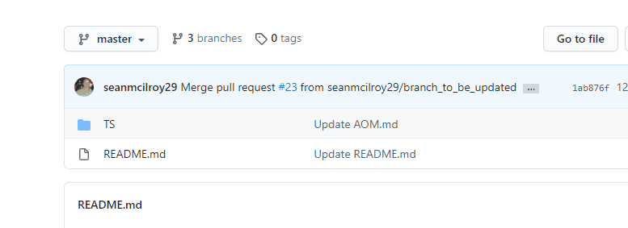

# Branching Defined

When you create a branch, you are essentially creating an identical copy of the project at that point in time. This isn't the same as creating a physical copy on disk. In the background, a branch is just a pointer.

Let's learn how you can create a new branch.

## Creating A Branch with GitHub

Follow these steps to create a new branch in the class repository:

> You will need to have collaborator access on the class repository before you can create a branch on GitHub.

1. Navigate to **Code** tab of the class repository.
1. Click the *branch dropdown*.
1. Enter the branch name 'github-username-caption'.
1. Select the blue Create branch box or hit **Enter** on your keyboard.

When you create a new branch on GitHub, you are automatically switched to your branch. Now, any changes you make to the files in the repository will be applied to this new branch.

> A word of caution. When you return to the repository or click the top level repository link, notice that GitHub automatically assumes you want to see the items on the default branch. If you want to continue working on a feature branch, you will need to reselect it using the branch dropdown.

## Branching with Git

The first step in the GitHub Workflow is to create a branch. This will allow us to experiment with new features without accidentally introducing untested changes on our production branch.
 - [A GitHub Training Video on branching](https://youtu.be/H5GJfcp3p4Q) 
