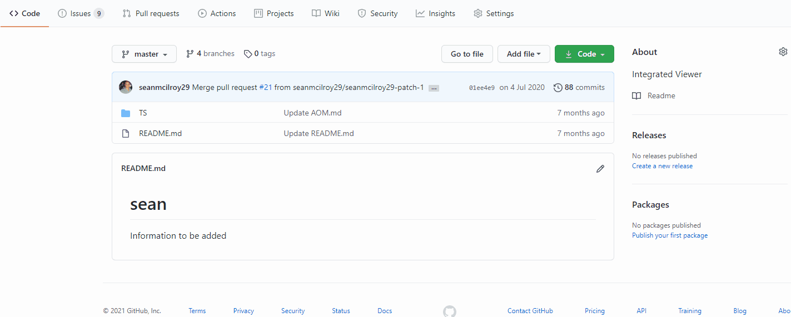

# About Issues
You can collect user feedback, report software bugs, and organize tasks you'd like to accomplish with issues in a repository. Issues can act as more than just a place to report software bugs.

Other conversations are more suitable for discussions. You can use discussions to ask and answer questions, share information, make announcements, and conduct or participate in conversations about a project. 

## Creating an Issue
  - Issues can be used to keep track of bugs, enhancements, or other requests.
  - People with read permissions can create an issue in a repository where issues are enabled.
  - You can open a new issue based on code from an existing pull request. 
  

Step
1. On GitHub, navigate to the main page of the repository.
1. Under your repository name, click  **Issues**.
1. Click **New issue**.
1. If there are multiple issue types, click **Get started** next to the type of issue you'd like to open.
1. Optionally, click **Open a blank issue**. if the type of issue you'd like to open isn't included in the available options.
1. Type a title and description for your issue.
1. If you're a project maintainer, you can assign the issue to someone, add it to a project board, associate it with a milestone, or apply a label.
1. When you're finished, click Submit new issue.

Issues can also be assigned to other users, tagged with labels for quicker searching, and grouped together with milestones.

## Creating a Label
Step
1. On GitHub, navigate to the main page of the repository.
1. Under your repository name, click  **Issues** or  **Pull requests**.
1. Above the list of issues or pull requests, click **Labels**.
1. To the right of the search field, click New **label**.
1. Under "Label name", type a name for your label.
1. Under "Description", type a description to help others understand and use your label.
1. Optionally, to customize the color of your label, edit the hexadecimal number, or click the **refresh button** for another random selection.
1. To save the new label, click **Create label**.

## Applying labels to issues and pull requests 

GitHub provides default labels in every new repository. You can use these default labels to help create a standard workflow in a repository.

1. On GitHub, navigate to the main page of the repository.
1. Under your repository name, click  **Issues** or  **Pull requests**.
1. In the upper-right corner, click **Label**, then start typing the name of an existing label. Click the **label's** name to associate it with the selected items.
